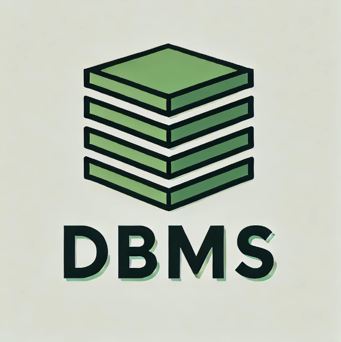

# Custom Database Management System
This project is a lightweight, individual statement or file-based database management system that takes in SQL and generates custom databases with tables and views. The database can be generated with ease, modified via an intuitive Flask web application, and exported as a JSON file to the user's PC.

# Key Features:

**Flask Web Application:** A user-friendly web interface allows users to submit SQL queries, view database outputs, and export the database. This interface streamlines database interaction without requiring direct command-line usage.

**Transaction Handling:** Supports transaction operations like BEGIN, COMMIT, and ROLLBACK for individual connections, ensuring data consistency and integrity during transactions.

**Locking Mechanisms:** Implements shared, reserved, and exclusive locks with support for transaction modes: DEFERRED, IMMEDIATE, and EXCLUSIVE.

**Data Export:** Allows seamless export of the database as a JSON file for easy storage or integration with other tools and systems.

# SQL Statement Support for:
- CREATE TABLE
- DROP TABLE
- INSERT INTO
- SELECT
- SELECT DISTINCT
- SELECT WITH WHERE
- SELECT WITH ORDER BY
- UPDATE
- DELETE
- BEGIN TRANSACTION
- COMMIT TRANSACTION
- ROLLBACK TRANSACTION
- Multi Insert Statements

# In Progress:
- Support for ASCENDING/DESCENDING statements.
- Support for INNER, LEFT, FULL OUTER, and RIGHT JOIN statements.
- Support for different file types being exported using custom file conversion commands.
- Support for NULLs.
- Updating the Flask application for users to create and query their own database online and export it to their computer.

